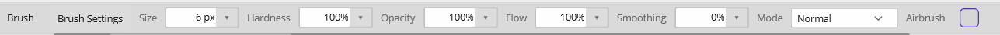

# The Brush Engine

One shared brush engine drives every stroke-based tool: **Brush, Eraser, Clone, Heal, Blur, Sharpen, Smudge, Dodge, Burn, Sponge,** and **Color Replacement**. Each tool exposes the relevant subset of these controls in its options bar.

## Parameters

| Setting | Range | What it does |
|---|---|---|
| **Size** | 1–2048 px | Diameter of the brush tip. |
| **Tip shape** | Round / Square | Round tips can be fractional size; square tips snap to pixels for pixel-art. |
| **Hardness** | 0–100% | Edge falloff. 100% is a hard edge; lower is soft and feathered. |
| **Opacity** | 0–100% | The maximum coverage a single continuous stroke can build to. |
| **Flow** | 0–100% | How much coverage each dab lays down; overlapping dabs build up toward the opacity ceiling. |
| **Spacing** | 1–100% | Distance between dabs along the stroke, as a fraction of the tip diameter. |
| **Smoothing** | 0–100% | Stroke stabilizer — averages input to reduce freehand jitter. |
| **Mode** | blend modes | The blend mode applied to the stroke, from the same set as layer [blend modes](layers.md#blend-modes). |
| **Airbrush** | toggle | When on, paint keeps building up at the flow rate while you hold the button still. |

**Opacity vs. Flow:** opacity is the ceiling a stroke can reach; flow is how fast it gets there. Low flow + high opacity lets you build up tone gradually by going over an area repeatedly.

The **Pencil** is deliberately *outside* this engine — it's always a 1px hard pixel with no anti-aliasing, flow, or spacing.

## Custom tips and presets

- **Edit ▸ Define Brush** captures the current selection (or the whole layer) as a reusable brush tip. The captured shape becomes the dab, and it appears in the **Brushes** panel.
- **Edit ▸ Save Brush Preset** saves the current brush settings for later recall.
- Custom tips and presets live in the **Patterns / Brushes** panel group in the dock.
