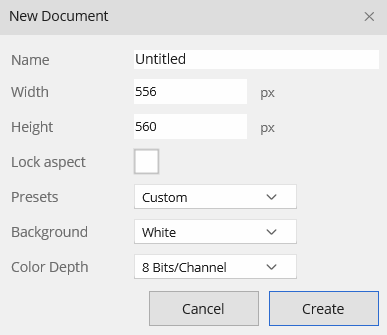
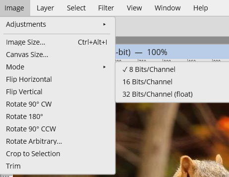

# Color Depth (8 / 16 / 32-bit)

Bitmute documents can be 8, 16, or 32-bit per channel. Higher depth matters for game data where 8 bits isn't enough precision — height and displacement maps, normal-map sources, and HDR data — because banding in a low-precision height map turns into visible stepping once it's lit or turned into a normal map.

| Depth | Use for |
|---|---|
| **8 Bits/Channel** | Normal color work (default) |
| **16 Bits/Channel** | Height/displacement maps, smoother normal-map sources |
| **32 Bits/Channel (float)** | HDR data; values are kept in floating point |

## Setting the depth

Choose the depth when you create a document, in the **Color Depth** picker of the New Document dialog:

Or convert an existing document with **Image ▸ Mode**. The current depth is checkmarked; converting is undoable.

The document's depth is shown in its window title (e.g. `heightmap.png (16-bit)`).

## What works at high depth

The core workflow is depth-aware: compositing, painting with the Brush and Eraser, undo/redo, and the gamedev-relevant filters (Invert, Brightness/Contrast, Posterize, Threshold, Offset, the blur/sharpen family, Desaturate/Hue-Saturation, and **Normal Map**) all operate at 16/32-bit. High-depth documents save and reload losslessly as native `.bitmute` files and as 16-bit PNG.

## Notes and limits

- Filters that haven't been converted to high depth are blocked on 16/32-bit documents (with a message) rather than run, so they can't corrupt the image — convert to 8-bit first if you need one of them.
- Some of the more artistic filters and a few secondary brush tools are 8-bit only for now.
- The on-screen display is down-converted to 8-bit for viewing; the document keeps its full precision.

This is an actively developing area — expect more of the filter set and tools to become depth-aware over time.
