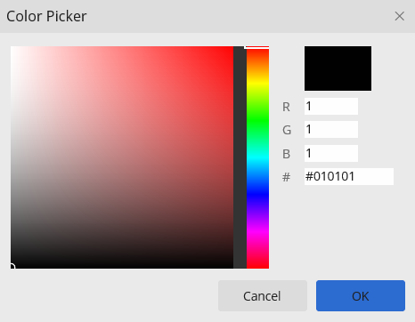
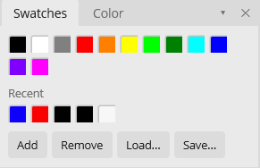

# Color & Swatches

Bitmute works in RGBA. Painting and fills use the **foreground** color; some tools and fills use the **background** color as well.

- **X** swaps foreground and background.
- **D** resets them to black and white.

The swatches sit at the bottom of the toolbar.

## Color picker

The **Color** tab (in the Swatches / Color dock group) is the color picker: HSV and RGB sliders plus a hex input.

Set the foreground by picking here, or sample a color from the canvas with the **Eyedropper** (`I`) — `Alt`+click sets the background instead. Most paint tools also accept `Alt`+click as a temporary eyedropper.

## Swatches panel

The **Swatches** tab holds a grid of saved colors and a strip of recent picks.

- Click a swatch to set the foreground; `Alt`+click for the background.
- **Add** the current foreground to the grid; **Remove** a swatch.
- The **Recent** strip fills automatically as you pick colors.
- **Load…** / **Save…** read and write `.gpl` palette files, so you can share palettes with other tools.
