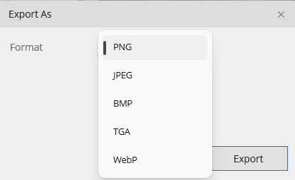

# Files & Formats

## Supported formats

| Format | Open | Save/Export | Notes |
|---|---|---|---|
| **PNG** | ✓ | ✓ | Primary format; preserves alpha |
| **JPEG** | ✓ | ✓ | Quality option on export |
| **BMP** | ✓ | ✓ | Legacy |
| **TGA** | ✓ | ✓ | Common in game engines; 24/32-bit, optional RLE compression |
| **WebP** | ✓ | ✓ | Lossy or lossless, quality slider |
| **GIF** | ✓ | — | Read only (imports the first frame) |
| **`.bitmute`** | ✓ | ✓ | Native project format — keeps layers, editable text, and selection |

## Save vs. Export

These do different jobs:

- **Save** (`Ctrl+S`) / **Save As** (`Ctrl+Shift+S`) keep your document *editable*. Save is format-aware: a document that has grown beyond a flat format (multiple layers, text) is steered to the native `.bitmute` project format so nothing is lost. A single-layer document that still fits its original flat format saves in place.
- **Export As** (`Ctrl+Alt+Shift+S`) flattens the document and writes a standard image (PNG, JPEG, BMP, TGA, WebP), with format-specific options in the dialog.

Use **Save** while you're working; use **Export** to produce the final flat asset for your engine or another app.

## Opening files

- **File ▸ Open** (`Ctrl+O`).
- **File ▸ Open Recent** — a flyout of recently used files.
- **Drag and drop** — drop a file onto an open canvas to add it as a new layer, or onto the empty workspace to open it as a new document.

## The `.bitmute` project format

`.bitmute` is a plain **ZIP container** (inspired by OpenRaster), so it's inspectable and non-proprietary — you can rename it to `.zip` and look inside. It holds:

- `manifest.json` — the document, the layer tree, and all metadata
- `thumbnail.png` — a small composite preview
- per-layer raw pixel data
- per-text-layer editable spec (string + font/character settings) plus a rendered cache
- the active selection mask, if any

Because it's a zip of JSON and data blobs, files stay readable and partially recoverable across app versions, and readers skip anything they don't recognize.
