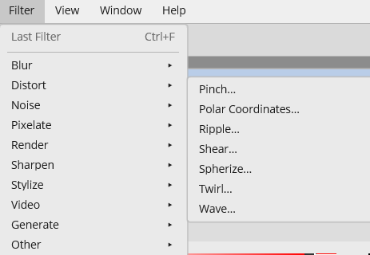
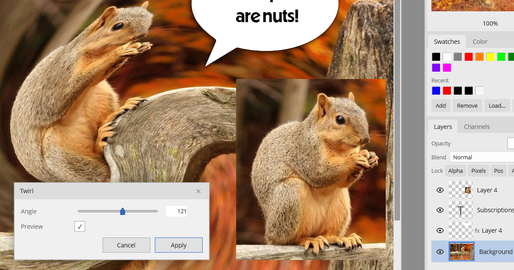
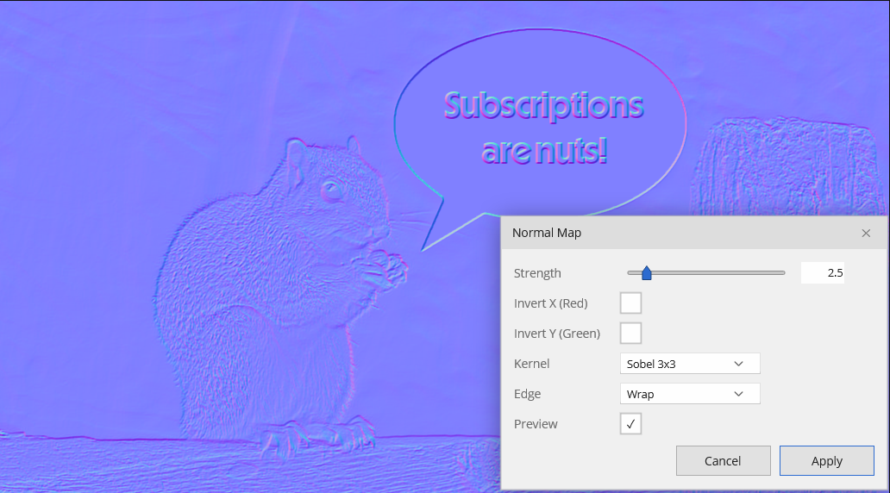

# Filters & Adjustments

Filters and adjustments modify the pixels on the **active layer** (clipped to the selection if one is active) and apply as a single undoable step. Most open a dialog with a **live on-canvas preview**, a Preview toggle, and OK/Cancel.

**Last Filter** (`Ctrl+F`) at the top of the Filter menu repeats the most recent filter with the same settings — the menu label shows which one.

## Adjustments (Image ▸ Adjustments)

| Adjustment | Controls |
|---|---|
| **Brightness/Contrast** | Brightness −100…100, Contrast −100…100 |
| **Hue/Saturation** | Hue −180…180, Saturation −100…100, Lightness −100…100 |
| **Desaturate** | Instant — converts to gray (stays RGBA) |
| **Invert Colors** (`Ctrl+I`) | Instant |
| **Posterize** | Levels 2…64 |
| **Threshold** | Level 0…255 → black/white |

## Filters (Filter menu)

A representative slider filter with live preview:

**Blur**
- Average, Blur, Blur More
- Box Blur (radius), Gaussian Blur (radius), Motion Blur (angle, distance), Radial Blur (amount; Spin/Zoom)

**Distort**
- Pinch, Twirl
- Polar Coordinates (Rectangular↔Polar), Ripple (amount; Small/Medium/Large), Shear (amount; Wrap/Repeat), Spherize (amount; Normal/Horizontal/Vertical), Wave (wavelength, amplitude; Sine/Triangle/Square)

**Noise**
- Add Noise (amount; Color/Monochromatic), Despeckle, Median (radius)

**Pixelate**
- Crystallize (cell size), Facet, Fragment, Mosaic (cell size), Pointillize (cell size)

**Render**
- Clouds, Difference Clouds (both use the foreground/background colors)

**Sharpen**
- Sharpen, Sharpen Edges, Sharpen More, Unsharp Mask (amount, radius)

**Stylize**
- Diffuse (Normal/Darken/Lighten), Emboss (angle, height, amount), Find Edges, Solarize

**Video**
- De-Interlace (odd/even fields; duplication/interpolation)

**Generate**
- **Normal Map** (below)

**Other**
- High Pass (radius)
- **Offset** — shift the layer horizontally/vertically with a choice of **Wrap Around**, **Repeat Edge Pixels**, or **Transparent** for the exposed area. Wrap is the key one for authoring seamless/tiling textures: offset by half, fix the seam that appears in the middle, then offset back.

## Normal Map (Filter ▸ Generate)

Generates a tangent-space normal map from the layer's grayscale height, for use as a game material texture.

Controls:

- **Strength** (0.1–20)
- **Invert X (Red)** / **Invert Y (Green)** — flip the channel directions to match your engine's convention
- **Kernel** — Sobel 3×3, Prewitt 3×3, 5×5, or 9×9 (larger kernels are smoother)
- **Edge** — Wrap (for tiling textures) or Clamp

Pair it with a 16-bit height source for smoother results — see [Color Depth](color-depth.md).
