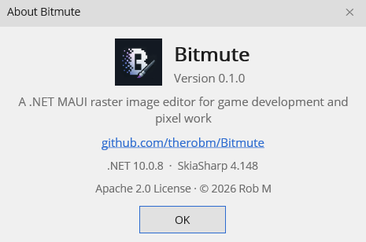

# Getting Started

## Requirements

- Windows 10 (build 19041) or Windows 11.

The published build is self-contained — it bundles its own runtime, so you don't need to install .NET separately. Just download the release and run it.

## Install

Grab the latest build from the [Releases](https://github.com/therobm/Bitmute/releases) page and run the executable.

### Building from source

If you'd rather build it yourself, clone the repo and run:

```
dotnet build
```

To produce a self-contained single-file release build, use `publish.bat`.

## First launch

Bitmute opens as a single window with a floating "desktop" inside it. Documents are child windows on that desktop; the tools and panels sit around them. See [The Workspace](workspace.md) for the full tour.

## Create a new document

**File ▸ New** (`Ctrl+N`) opens the New Document dialog:

- **Name**, **Width**, and **Height** (in pixels)
- **Lock aspect** to keep the width/height ratio while you type
- **Presets** for common sizes
- **Background**: White or Transparent
- **Color Depth**: 8, 16, or 32 bits per channel — see [Color Depth](color-depth.md)

Click **Create** and you get a blank canvas.

## Open an image

**File ▸ Open** (`Ctrl+O`), or drag a file onto the workspace. Bitmute reads PNG, JPEG, BMP, TGA, WebP, GIF (first frame), and its own `.bitmute` project files. Recently used files are under **File ▸ Open Recent**.

You can also drag a file directly **onto an open canvas** to add it as a new layer.

## Save and export

- **File ▸ Save** (`Ctrl+S`) / **Save As** (`Ctrl+Shift+S`) — Save is format-aware: a multi-layer or text document is steered toward the native `.bitmute` project format so nothing is lost.
- **File ▸ Export As** (`Ctrl+Alt+Shift+S`) — flattens and writes a standard image (PNG, JPEG, BMP, TGA, WebP) with per-format options.

The difference matters: **Save** keeps your layers, text, and selection editable; **Export** produces a flat file for use elsewhere. See [Files & Formats](files.md).

## About

**Help ▸ About Bitmute** shows the app version, the .NET/SkiaSharp runtime versions (handy for bug reports), and the Apache 2.0 license.



## Where to next

- [Tools](tools.md) to start painting and selecting
- [Layers](layers.md) to build up an image non-destructively
- [Keyboard Shortcuts](keyboard-shortcuts.md) for the cheat sheet
