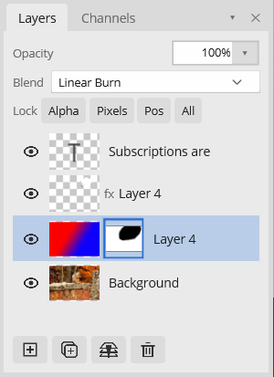
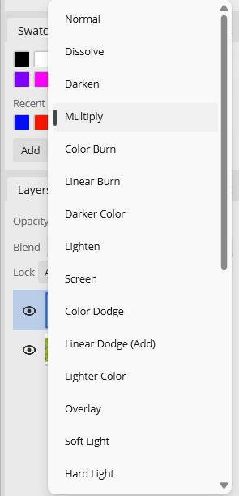
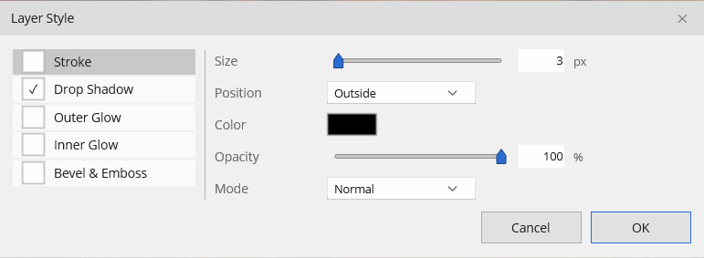
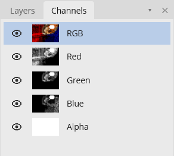

# Layers, Blend Modes & Styles

Layers stack bottom-to-top and composite into the final image. The **Layers** panel (in the Layers / Channels dock group) is where you manage them.

At the top of the panel: the active layer's **Opacity**, its **Blend** mode, and the **Lock** row. Below that is the layer list, and along the bottom are buttons to add, duplicate, merge, and delete layers.

## Managing layers

| Action | How |
|---|---|
| New layer | Layer ▸ New Layer, or the **+** button |
| Delete layer | Layer ▸ Delete Layer, or the trash button |
| Duplicate | `Ctrl+J` |
| Merge down | Layer ▸ Merge Down (`Ctrl+E`) |
| Merge visible | Layer ▸ Merge Visible (`Ctrl+Shift+E`) |
| Flatten image | Layer ▸ Flatten Image |
| Reorder | Drag a row up or down |
| Multi-select | `Ctrl`-click to toggle rows, `Shift`-click for a range |

Toggle a layer's visibility with the eye icon on its row. Per-layer **opacity** and **blend mode** apply to everything on the layer, including text and layer styles.

## Layer types

- **Pixel** layers hold ordinary pixels.
- **Text** layers stay editable — re-render from the source string any time (see [Text](text.md)). **Layer ▸ Rasterize Text** converts a text layer to a normal pixel layer.

## Locks

Each layer has four independent locks in the Lock row:

- **Alpha** — paint only where pixels already exist (preserves transparency).
- **Pixels** — block paint/erase, but allow move and reorder.
- **Pos** — block move/offset, but allow painting.
- **All** — no edits, moves, or deletes.

## Layer masks

A layer mask hides or reveals parts of a layer without touching its pixels — paint **black to hide**, **white to reveal**, and gray for partial. The mask shows as a second thumbnail next to the layer's thumbnail; while it's the active target, painting, filling, and gradients apply to the mask. Masks can be added, applied (baked into the pixels), and removed, and they're saved in `.bitmute`.

## Blend modes

Every layer (and every brush-family stroke) can use the full set of blend modes, presented in the standard grouped dropdown:

- **Normal** — Normal, Dissolve
- **Darken** — Darken, Multiply, Color Burn, Linear Burn, Darker Color
- **Lighten** — Lighten, Screen, Color Dodge, Linear Dodge (Add), Lighter Color
- **Contrast** — Overlay, Soft Light, Hard Light, Vivid Light, Linear Light, Pin Light, Hard Mix
- **Comparative** — Difference, Exclusion, Subtract, Divide
- **Component** — Hue, Saturation, Color, Luminosity

## Layer styles

Non-destructive effects rendered live around the layer's pixels, baked in only on flatten or export. Open **Layer ▸ Layer Style…** (or right-click the layer). The dialog is two-panel — a checklist of effects on the left, the selected effect's controls on the right — with a live on-canvas preview.

Available effects:

- **Stroke** — size, position (inside/center/outside), color, blend mode, opacity
- **Drop Shadow** — color, opacity, angle, distance, size, spread, blend mode
- **Outer Glow** / **Inner Glow** — color, opacity, size, spread, blend mode
- **Bevel & Emboss** — depth, size, angle, highlight/shadow colors and blend mode

A layer with any effect enabled shows an **fx** marker on its row. You can copy and paste a whole style set between layers from the layer's right-click menu. Styles are saved per layer in `.bitmute`.

> These layer-style effects are non-destructive. They're distinct from **Edit ▸ Stroke**, which writes pixels directly.

## Channels

The **Channels** tab (next to Layers) shows the document's Red, Green, Blue, and Alpha channels as grayscale, each with a live thumbnail. It's the fast way to check an alpha mask's integrity without exporting.

