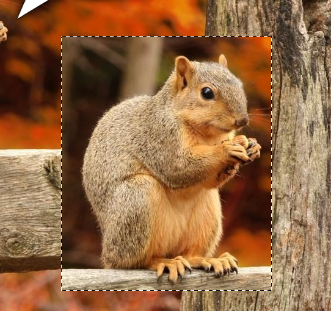

# Selections

A selection restricts where edits land. Bitmute stores selections as an **8-bit coverage mask** (0–255 per pixel), so edges can be feathered and anti-aliased, and a partially selected pixel gets a partial edit. The "marching ants" outline traces the 50%-coverage contour.

## Making selections

- **Box / Circle Select** (`M` / `Shift+M`) — rectangular and elliptical marquees. `Shift` constrains to a square/circle.
- **Freehand / Poly / Magnetic Lasso** (`L`, `Shift+L`) — draw freehand, click straight-edged vertices, or trace an edge that snaps to contrast.
- **Magic Wand** (`W`) — select by color similarity, with tolerance, contiguous, sample-all-layers, and anti-alias options.

## Selection modes

The options bar shows four mode buttons (they also have modifier keys):

| Mode | Modifier | Result |
|---|---|---|
| **New** | — | Replace the current selection (default) |
| **Add** | `Shift` | Union with the current selection |
| **Subtract** | `Alt` | Remove from the current selection |
| **Intersect** | `Shift+Alt` | Keep only the overlap |

## Options

- **Feather** — softens the selection edge by the given radius (px).
- **Anti-alias** — smooths the edge. Ellipse selections use exact edge coverage; lassos and the wand use boundary smoothing. (Rectangle marquees are always hard-edged by design.)

## The Select menu

- **All** (`Ctrl+A`) — select the whole canvas.
- **Deselect** (`Ctrl+D`) — clear the selection.
- **Invert** (`Ctrl+Shift+I`) — swap selected and unselected areas.
- **Feather…** — feather the current selection in place by a radius you specify.

## Working with selections

- Paint, fill, gradients, filters, and delete/fill all clip to the selection. With no selection, they affect the whole layer.
- **Move** a selection with the Move tool to lift a floating piece that follows the marquee; it composites back into the layer when you deselect.
- **Delete** clears the selected pixels; **Alt+Delete** fills them with the foreground color and **Ctrl+Delete** with the background.
- `Ctrl`+click a layer's thumbnail to load that layer's opaque pixels as a selection.
