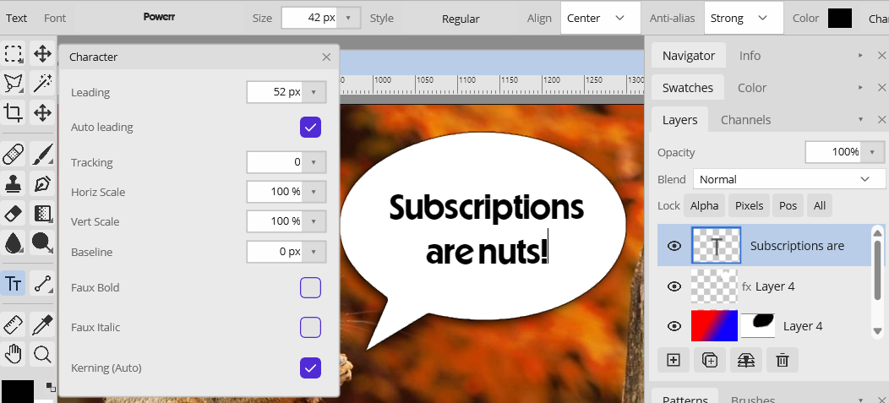

# Text

The **Text** tool (`T`) creates an **editable text layer** — the layer keeps the source string and all its formatting, so you can re-edit it any time until you rasterize it.

## Entering and editing text

Click on the canvas with the Text tool to place an insertion point, then type directly on the canvas with a live caret. Use the arrow keys to move and select. To edit existing text, select its layer with the Text tool and click into it.

- **Enter** commits the text and exits edit mode (the layer stays editable).
- **Shift+Enter** inserts a line break.
- **Esc** cancels the current edit.

## Options bar

- **Font family** — with an Aa preview in the pull-down.
- **Style** — Regular / Bold / Italic / Bold Italic (uses the font's real faces where available).
- **Size** in points.
- **Alignment** — left, center, right.
- **Color** — defaults to the current foreground; changing the foreground later doesn't retro-edit existing text.
- **Anti-alias method** — None, Sharp, Crisp, Strong, or Smooth. **None** gives crisp aliased text for a pixel-art / bitmap-font look; the others tune the smoothing.

## Character panel

Open the **Character** panel from the Text options bar for finer typography (applied to the whole text object):

- **Leading** — line height
- **Kerning** — Auto (metric) or off
- **Tracking** — uniform letter spacing
- **Horizontal / Vertical scale** — condense/expand or squash/stretch the glyphs
- **Baseline shift**
- **Faux Bold / Faux Italic** — synthesized when the font lacks real bold/italic faces

## Rasterizing

**Layer ▸ Rasterize Text** converts a text layer to ordinary pixels (dropping editability). Exporting to a flat image format rasterizes automatically. Opacity, blend mode, locks, and layer styles all apply to a text layer just like any other layer, and the editable text is preserved in `.bitmute` files.
