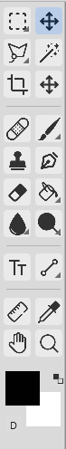
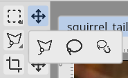
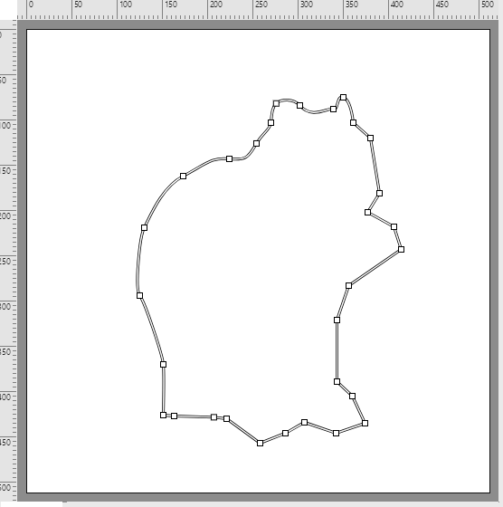

# Tools

The toolbar is a two-column grid down the left edge. The foreground/background color swatches sit at the bottom — press **X** to swap them and **D** to reset to black/white.

## Flyout groups

Some cells hold a small group of related tools. The active tool shows in the cell with a small **triangle** in its corner. **Click and hold** (or right-click) the cell to pop the group open, then release on the tool you want. Each tool's shortcut key also **cycles** through its group with **Shift+key**. Whichever member you used last becomes the cell's visible tool.

## Tool reference

Single-key shortcuts are shown in parentheses. Shift+key cycles within a flyout group.

| Tool | Key | What it does |
|---|---|---|
| **Box Select** | M | Rectangular marquee selection. `Shift` constrains to a square. |
| **Circle Select** | ⇧M | Elliptical marquee. `Shift` constrains to a circle. |
| **Freehand Lasso** | L | Draw a freehand selection outline; release to close it. |
| **Poly Lasso** | ⇧L | Click to place straight-edged selection vertices; close on the first point or double-click. |
| **Magnetic Lasso** | ⇧L | Trace an edge and the selection snaps to the strongest nearby contrast. |
| **Magic Wand** | W | Select by color similarity — tolerance, contiguous, sample-all-layers, anti-alias. |
| **Move** | V | Move the active layer, or a floating selection. |
| **Move Canvas (Hand)** | H | Pan the viewport by dragging. |
| **Crop** | C | Drag a rectangle with handles; commit to resize the canvas to it. |
| **Eyedropper** | I | Sample a color to the foreground (`Alt` sets the background). |
| **Ruler / Measure** | ⇧I | Drag to measure length, angle, and dx/dy (shown in the status bar). |
| **Brush** | B | The main paint tool — see [The Brush Engine](brush-engine.md). |
| **Pencil** | ⇧B | 1px hard-edged pixel paint, no anti-aliasing. |
| **Color Replacement** | ⇧B | Replace hue/saturation under the stroke with the foreground color. |
| **Clone** | S | `Alt`+click sets a source point, then paints those pixels elsewhere. |
| **Heal** | ⇧S | Like Clone, but blends the sampled texture into the surrounding color/luminance. |
| **Eraser** | E | Erases to transparent using the brush tip (soft erase with hardness/opacity). |
| **Fill (Bucket)** | G | Flood-fill with the foreground color, clipped to the selection. |
| **Gradient** | ⇧G | Drag to define a gradient axis — linear, radial, angle, reflected, or diamond. |
| **Line** | U | Drag a straight line. `Shift` constrains to 45°. |
| **Rectangle / Rounded Rect / Ellipse / Polygon** | ⇧U | Drag to draw a filled shape. `Shift` constrains proportions. |
| **Blur** | R | Brush-style blur along the stroke. `Alt` momentarily sharpens. |
| **Sharpen** | ⇧R | Brush-style sharpen. `Alt` momentarily blurs. |
| **Smudge** | ⇧R | Push/smear pixels along the stroke like wet paint. |
| **Dodge** | O | Lighten along the stroke. `Alt` swaps to Burn. |
| **Burn** | ⇧O | Darken along the stroke. |
| **Sponge** | ⇧O | Saturate or desaturate along the stroke (mode toggle). |
| **Text** | T | Create or edit an editable text layer — see [Text](text.md). |
| **Zoom** | Z | Click to zoom in, `Alt`+click to zoom out; drag a marquee to zoom into a region. |
| **Pen** | P | Draw editable Bézier paths (below). |
| **Direct Selection** | A | Edit the anchor points and handles of a path. |

Most paint tools accept `Alt`+click as an eyedropper, so you can pick a color mid-stroke.

## Paths (Pen & Direct Selection)

The **Pen** tool (`P`) places anchor points to build a Bézier path — click for corner points, drag for curve handles. Paths can be open or closed (click the first anchor to close). The **Direct Selection** tool (`A`) edits an existing path: drag anchors or their handles, `Alt`+click an anchor to convert it between corner and smooth, and click an anchor to remove it. While the Pen is active, holding `Ctrl` temporarily switches to Direct Selection so you can adjust a point without changing tools.

## Options bar

Every tool exposes its settings in the **options bar** under the menu. Selection tools show the selection mode and feather; brush-family tools show size, hardness, opacity, flow, and more (see [The Brush Engine](brush-engine.md)); the Text tool shows font and alignment controls. The bar swaps automatically when you switch tools.
