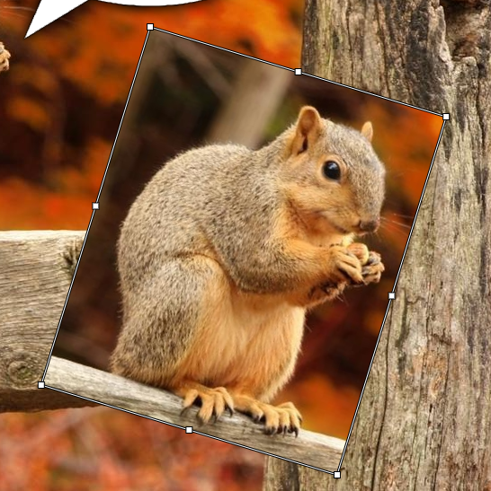
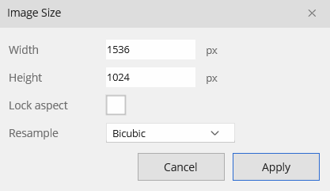

# Transform & Canvas

## Free Transform

**Edit ▸ Transform ▸ Free Transform** (`Ctrl+T`) puts the active layer (or a floating selection) into a transform mode with a live warped preview. The Transform submenu also has dedicated **Scale**, **Rotate**, **Skew**, **Distort**, **Perspective**, and layer **Flip Horizontal/Vertical** entries.

- Drag a **corner or edge handle** to scale.
- Hover just outside a corner to **rotate** (`Shift` snaps to 15°).
- `Shift` locks aspect while scaling; `Alt` scales from the center.
- **Enter** (or double-click) commits; **Esc** cancels and restores.

The preview keeps the layer's blend mode, opacity, and styles, and respects the layers above it. When a selection is active, only that floating piece transforms; a whole-layer transform fits the box to the layer's content.

## Canvas and image size

Two different resize operations — keep them straight:

- **Image ▸ Image Size…** (`Ctrl+Alt+I`) — *resamples* the image to new dimensions. Everything scales.
- **Image ▸ Canvas Size…** — changes the *frame* without resampling. A 3×3 anchor positions the existing content in the new frame; growing adds transparent margin.

## Rotate, flip, crop, trim

From the **Image** menu (these act on the whole document and are undoable):

- **Flip Horizontal / Vertical** — lossless.
- **Rotate 90° CW / 180° / 90° CCW** — lossless.
- **Rotate Arbitrary…** — rotate by any angle; the canvas auto-expands so nothing is clipped, and the newly exposed corners are transparent.
- **Crop to Selection** — crop the canvas to the selection bounds.
- **Trim** — auto-crop away a transparent or solid-color border.
