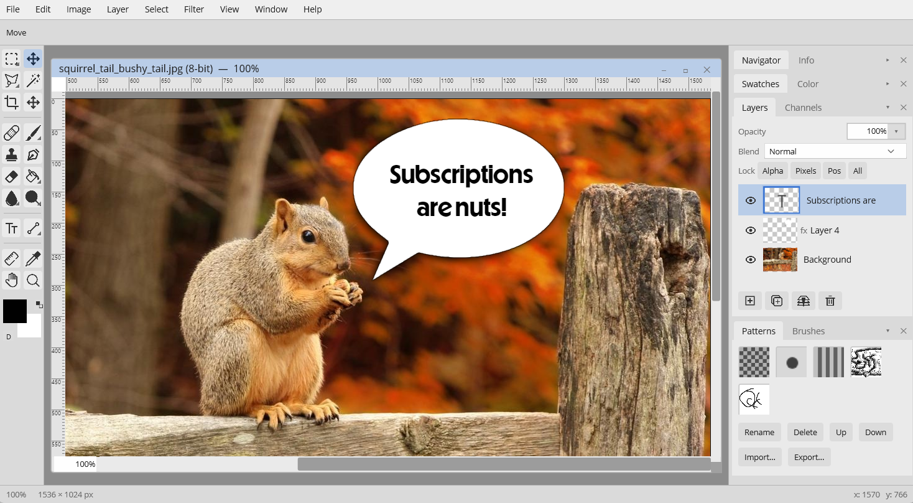
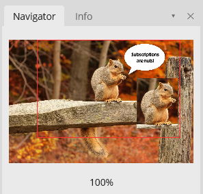
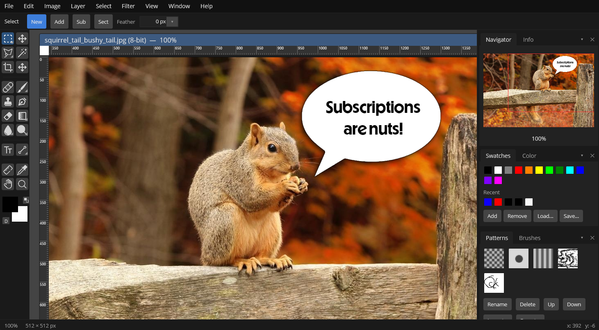
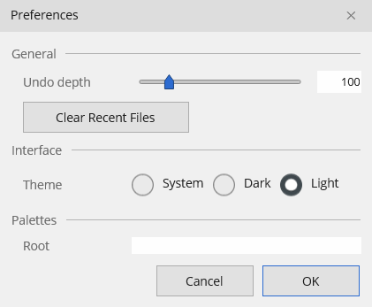

# The Workspace

Bitmute runs in a single window that acts as a workspace "desktop." Open documents are floating child windows inside it (each with its own title bar, rulers, and scrollbars), and the tools and panels sit around them.

## Window regions

- **Menu bar** (top) — File, Edit, Image, Layer, Select, Filter, View, Window, Help.
- **Options bar** (just under the menu) — context-sensitive; its contents change with the active tool.
- **Toolbar** (left) — a two-column grid of tools, with the foreground/background color swatches beneath it. See [Tools](tools.md).
- **Panel dock** (right) — tabbed panel groups (below).
- **Canvas area** (center) — your document windows.
- **Status bar** (bottom) — cursor position, zoom level, selection size, and document dimensions.

Each document window shows its name, color depth, and zoom in its title bar (e.g. `squirrel.jpg (8-bit) — 100%`), and has an editable **zoom-% field** at its bottom-left — type a value to jump to that zoom.

## Panels

The dock holds four tabbed groups, each with two tabs:

| Group | Tabs |
|---|---|
| Navigator | **Navigator**, **Info** |
| Swatches | **Swatches**, **Color** |
| Layers | **Layers**, **Channels** |
| Patterns | **Patterns**, **Brushes** |

- **Navigator** — a thumbnail of the whole document with a draggable view-rect; drag it to pan.
- **Info** — live readout of cursor position and the pixel value under it, plus selection dimensions.

- **Swatches / Color** — saved and recent colors, and the RGB/HSV color picker. See [Color](color.md).
- **Layers / Channels** — the layer stack and a per-channel grayscale view. See [Layers](layers.md).
- **Patterns / Brushes** — captured patterns and custom brush tips.

Each panel has a collapse toggle (▾/▸) and a close button (✕) in its tab strip. Drag a tab strip up or down to reorder panels in the dock. The **Window** menu lists the panels with a ✓ next to the visible ones — click to show or hide. Panel visibility, order, and collapsed state are remembered between sessions.

## Light and dark themes

Bitmute ships with light and dark themes; switch under **Edit ▸ Preferences ▸ Interface**. The choice persists across launches, and the native title bar is themed to match.

**Preferences** (`Edit ▸ Preferences`) also sets the undo depth. **Help ▸ About Bitmute** shows the version, runtime versions, and license.

## Rulers, grid, and guides

From the **View** menu:

- **Rulers** (`Ctrl+R`) — toggle the rulers around each document.
- **Grid** — toggle a canvas grid (with a finer pixel grid at high zoom).
- **Guides** — drag a guide out from a ruler: from the **top** ruler for a horizontal guide, from the **left** ruler for a vertical one. Reposition a guide by dragging it with any tool; drag it off the canvas to remove it. **Lock Guides** freezes them; **Clear Guides** removes them all. Guides are viewport overlays — they're never exported, but they are saved per document in `.bitmute`.
- **Snap** and **Snap To** — turn snapping on/off globally, then pick targets (Guides, Grid, Edges, Layers). With snapping on, marquees, crops, transforms, and moved objects snap their edges and centers to those targets.

## Panning and zooming

- **Pan** — hold **Space** and drag, use the **Hand** tool (`H`), or scroll (`Ctrl+Scroll` pans horizontally).
- **Zoom** — the **Zoom** tool (`Z`), `Ctrl++` / `Ctrl+-`, `Alt+Scroll`, or **View ▸ Fit on Screen** (`Ctrl+0`). Double-clicking the Zoom tool jumps to 100%; dragging a marquee with it zooms into that region.

## Multiple documents

Open as many documents as you like. The **Window** menu offers **Cascade** and **Tile** to arrange them. The active document's title bar is highlighted; inactive ones are dimmed.
