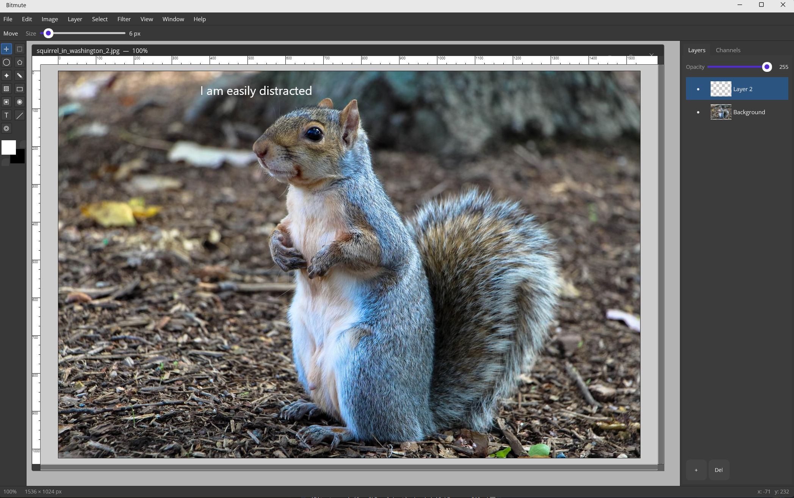

# Bitmute

A raster image editor for game development and general-purpose pixel work, built with .NET MAUI and SkiaSharp. Targets Windows (Linux as a future goal).



## Features

- 27 layer blend modes — the full classic set, including Linear Burn, Vivid/Linear/Pin Light, Hard Mix, Darker/Lighter Color, and Dissolve
- Non-destructive layer styles: drop shadow, inner/outer glow, bevel & emboss, and stroke, with live preview and copy/paste between layers
- Free Transform (Ctrl+T): scale, rotate, skew, distort, and perspective with a live warped preview
- Full brush engine — hardness, opacity, flow, spacing, stroke smoothing, airbrush, and per-stroke blend modes — shared across clone, heal, dodge/burn, sponge, smudge, color replacement, and more
- 35+ filters (Blur, Distort, Noise, Pixelate, Render, Sharpen, Stylize, Video) plus adjustments, all with live on-canvas preview
- Editable text layers with WYSIWYG in-canvas editing and a full character panel: leading, kerning, tracking, scale, baseline shift
- Selections as 8-bit coverage masks — feather, anti-alias, add/subtract/intersect modes, floating moves
- Channels panel with per-channel grayscale view — verify alpha mask integrity without exporting
- Import/export: PNG, JPEG, BMP, TGA (with RLE), WebP, GIF (read)
- Open `.bitmute` project format — a ZIP container, inspectable and partially recoverable, round-trips layers, editable text, and selections
- Canvas support up to 8K+ resolution with dirty-rect compositing and undo

## Building

```
dotnet build
```

## License

Apache 2.0
